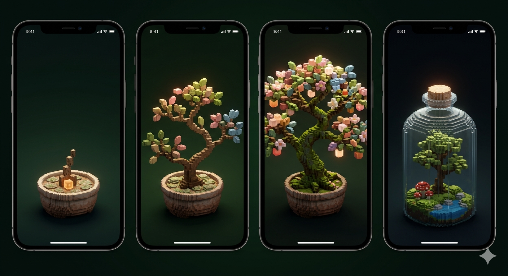

# Kodama — 木霊

**Being with something alive.**

A voxel bonsai tree that grows quietly on your iPhone. No tasks. No tracking. No goals. Just a small, living thing that shares your time.



---

## About

Kodama is a companion app, not a tool. A voxel bonsai grows autonomously over real-world time — through seasons, day and night, whether you open the app or not. When you return after a week, the tree has changed. New branches. Shifted colors. It did not wait for you.

If you choose to interact, you can touch it, give it color, or whisper a word. Each of these leaves a trace in the tree's growth. But interaction is never required. Opening the app is enough.

The name comes from 木霊 (*kodama*) — the Japanese concept of spirits that inhabit trees.

## Features

- **Procedural voxel bonsai** — hand-crafted aesthetic via SceneKit
- **Autonomous growth** — time-based, calculated on app open (no background processing)
- **Seasonal changes** — spring buds, summer foliage, autumn colors, winter snow
- **Touch** — the tree glows where you touch
- **Color** — a minimal palette tints future growth
- **Word** — a single word dissolves into the tree's invisible history
- **3D camera** — rotate and zoom freely
- **Fully local** — no network, no accounts, no tracking

## Tech Stack

| | |
|---|---|
| Platform | iOS 26+, iPhone only |
| Language | Swift 6.1+ / Xcode 26 |
| UI | SwiftUI + SceneKit |
| Persistence | SwiftData (local-first) |
| Architecture | MVVM |

## Getting Started

**Requirements:** Xcode 26+, iPhone with iOS 26+

```bash
# Build
xcodebuild -scheme Kodama -destination 'platform=iOS Simulator,name=iPhone 17' build

# Test
xcodebuild -scheme Kodama -destination 'platform=iOS Simulator,name=iPhone 17' -only-testing:KodamaTests test

# Lint
swiftlint

# Format
swiftformat .
```

During the current prototyping phase, the default test command runs internal logic tests only (`KodamaTests`). Run `KodamaUITests` separately only when UI verification is explicitly needed.

## Project Structure

```text
Kodama/
├── KodamaApp.swift       # App entry point
├── App/                  # AppState
├── Models/               # SwiftData models (BonsaiTree, VoxelBlock, Interaction…)
├── Views/                # SwiftUI views (TreeView, InteractionOverlay, Onboarding…)
├── ViewModels/           # TreeViewModel, GrowthEngine
└── Scene/                # SceneKit (BonsaiScene, BonsaiRenderer, TreeBuilder…)
```

Full spec: [`docs/kodama-mvp-spec.md`](docs/kodama-mvp-spec.md) · Concept: [`docs/kodama-concept.md`](docs/kodama-concept.md)

## License

© 2026 focuswave. All rights reserved.
